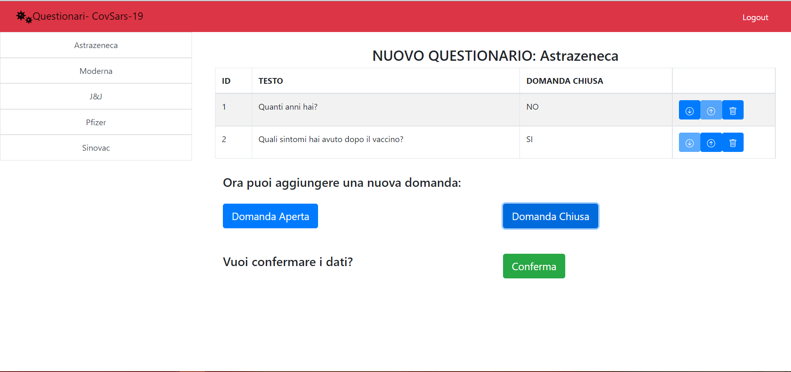

# Exam #1: "Questionario"
## Student: s286282 TEDDE ELISA 

## React Client Application Routes

- Route `/`: pagina principale dove
        -se utente è loggato e non ha selezionato un nuovo questionario
         ha la possibilità di aggiungere un nuovo questionario mentre
         se ne ha selezionato uno può vedere le risposte a quel questionario
        -se utente non è loggato e ha cliccato su un questionario ha la possibilità
        di procedere con la compilazione inserendo username
- Route `/AggiungiQuestionario`: utilizzata dall'admin per aggiungere un nuovo questionario
- Route `/VisualizzaQuestionari/:title`: utilizzata dall'admin per visualizzare
                           le risposte di un questionario
- Route `/Questionario/:title`: utilizzata da un utente non loggato per compilare
                      un nuovo questionario

## API Server
### _Retrieve the list of all the  available surveys_

URL: `/api/surveys`

HTTP Method: GET

Description: Get all surveys given the admin (if present)

Request body: None

Response body:
```
[
  {
    "id": 2,
    "title": "astrazena",
    "adminID": 1
    "compilazioni":1
  },
  {
    "id": 1,
    "title": "moderna",
    "adminID": 1
    "compilazioni":1
  },
  ...
]
```
### _Retrieve a list of all the questions that fulfill a given surveyID_

URL: `/api/questions/`

HTTP Method: GET

Description: Get all questions that fulfill a given surveyID `surveyID`.

Request body: None


Response body:
```
[
  {
    "id": 1,
    "text": "età",
    "surveyID": 1,
    "min": 1,
    "max": 1
    "maxrisposte":1
    "ordine":1
  },
    {
    "id": 2,
    "text": "food",
    "surveyID": 1,
    "min": 1,
    "max": 1
    "maxrisposte":1
    "ordine":2
  },
  ...
]
```
### _Retrieve a list of all the answers that fulfill a given surveyID_

URL: `/api/answers/`

HTTP Method: GET

Description: Get all answers that fulfill a given surveyID `surveyID` 

Request body: None

Response body:
```
[
  {
    "id": 2,
    "username": "eli",
    "text": "febbre",
    "questionID": 2
    "surveyID": 2
  },
  {
    "id": 3,
    "username": "eli",
    "text": "malditesta",
    "questionID": 2
    "surveyID": 2
  },
  ...
]
```
### _Retrieve the list of all the people that compiled a certain survey id_

URL: `/api/username`

HTTP Method: GET

Description: Get the list of all the people that compiled a certain survey id

Request body: None

Response body:
```
[
  mark, john..
  
]
```
### _Retrieve the list of all the multiple answers given a certain question id_

URL: `/api/multipleanswers`

HTTP Method: GET

Description: Retrieve the list of all the multiple answers given a certain question id

Request body: None

Response body:
```
[
  white, red..
]
```
### _Add a new question_

URL: `/api/questions`

HTTP Method: POST

Description: Add a new question.

Request body: An object that represents a question (Content-Type: `application/json`).
```
  {
    "text": "età",
    "surveyID": 1,
    "min": 1,
    "max": 1
    "maxrisposte":1
    "ordine":1
  }
```
### _Retrieve the total number of compiled survey_

URL: `/api/compiled`

HTTP Method: GET

Description: Retrieve the total number of compiled survey.

Request body: None

Response body:
```
  [
    4,
  ]
```
### _Add a new survey_

URL: `/api/surveys`

HTTP Method: POST

Description: Add a new survey.

Request body: An object that represents a survey (Content-Type: `application/json`).
```
{
  "title": "astrazena",
  "adminID": 1
  "compilazioni":1
}
```
Response body: 
```
[
  {
    "id": 15,
  }
]
```

### _Update the total number of compiled surveys given the surveyID_

URL: `/api/surveys`

HTTP Method: PUT

Description: Update an existing survey.

Request body: None.

Response body: None

### _Add a new answers_

URL: `/api/answers`

HTTP Method: POST

Description: Add a new answer.

Request body: An object that represents an answer (Content-Type: `application/json`).
```
  {
    "username": "eli",
    "text": "febbre",
    "questionID": 2
    "surveyID": 2
  }
```
Response body: 
```
[
  {
    "id": 15,
  }
]
```

### _Add an answer of a closed question_

URL: `/api/multipleanswers/`

HTTP Method: POST

Description: Add a new answer.

Request body: An object that represents an answer (Content-Type: `application/json`).
```
  {
    "answerText": "red",
    "questionID": "2"
  }
```
Response body: None

### _Add the username that compiled a certain surveyID_

URL: `/api/comp/`

HTTP Method: POST

Description: Add a new username that compiled a certain surveyID

Request body: An object (Content-Type: `application/json`).
```
  {
    "username": "eli",
    "surveyID": 2,
  }
```

Response body: None

### _Login_

HTTP method: `POST`  URL: `/api/sessions`

Description: authenticate the user who is trying to login

Request body: credentials of the user who is trying to login

``` 
{
    "username": "username",
    "password": "password"
}
```

Response body: authenticated user

``` 
{
    "id": 1,
    "username": "john", 
}
```
### _Check if user is logged in_

HTTP method: `GET`  URL: `/api/sessions/current`

Description: check if current user is logged in and get her data

Request body: _None_

Response body: authenticated user
``` 
{
    "id": 1,
    "username": "john", 
}
```
### _Logout_

HTTP method: `DELETE`  
URL: `/api/sessions/current`

Description: logout current user

Request body: _None_

Response body: _None_

## Database Tables

- Table `admins` - contains id, username, password
- Table `answers` - contains id, username, text, questionID, surveyID
- Table `compiled` - contains id, username, surveyID
- Table `multipleAnswers` - contains answerText, questionID
- Table `questions` - contains id, text, surveyID, min, max, maxrisposte, ordine
- Table `surveys` - contains id, title, adminID, compilazioni


## Main React Components

- `Answer` (in `Answer.js`): manages the object answer and its methods
- `Question` (in `Question.js`): manages the object question and its methods
- `Survey` (in `Survey.js`): manages the object survey and its methods
- `Main` (in `MyMain.js`): personalized version of Main
- `MyNavbar` (in `MyNavbar.js`): personalized version of Navbar with the login button
- `MySidebar` (in `MySidebar.js`): personalized version of Sidebar that shows all the surveys
- `CompileForm` (in `SurveyForms.js`): shows all the questions that are available for the given surveyID
                  and the user can compile it
- `VisualizeForm` (in `SurveyForms.js`):  shows all the answers that are given by users for 
                                a given surveyID
- `AddSurvey` (in `SurveyForms.js`): component to add a new survey
- `MyModal` (in `MyModal.js`): personalized modal used to log in or to insert the username
- `DomApertaMod` (in `MyModal.js`): personalized modal used to add a new open question
- `DomChiusaMod` (in `MyModal.js`): personalized modal used to add a new closed question
- `LoginForm` (in `MyForms.js`): personalized form for the login
- `UsernameForm` (in `MyForms.js`): personalized form that manages the username inserted by the user
- `DomApertaForm` (in `MyForms.js`): personalized form that manages a new opened question inserted by admin
- `DomChiusaForm` (in `MyForms.js`): personalized form that manages a new closed question inserted by admin
- `NameQuestForm` (in `MyForms.js`): personalized form that manage the survey name inserted by admin


## Screenshot

  

## Users Credentials

- elisa, ciaociao
- marco, password
